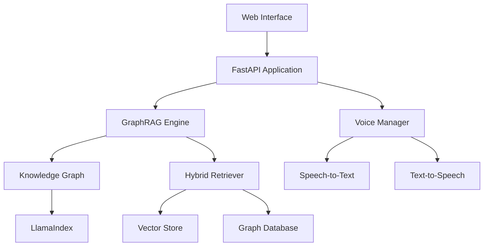

# Improved Local AI Assistant

**Production-Ready Local AI with Advanced Knowledge Graph Technology & Complete Voice Interface**

A high-performance, enterprise-grade local AI assistant featuring dynamic knowledge graph construction, GraphRAG (Graph Retrieval-Augmented Generation), and a world-class voice interface that rivals commercial assistants.

[](https://opensource.org/licenses/MIT)
[](https://www.python.org/downloads/)
[](https://github.com/psf/black)
[](https://github.com/hugokos/improved-local-assistant/actions)

## Key Features

### 🧠 GraphRAG Technology
- **Dynamic Knowledge Graphs**: Real-time entity extraction and relationship mapping
- **Chat-Memory Persistence**: Utterance-level provenance with speaker attribution
- **Hybrid Retrieval**: Combines graph traversal, semantic search, and keyword matching
- **Entity Canonicalization**: Prevents drift through embedding-based similarity matching

### 🎤 Voice Interface
- **100% Offline Processing**: Complete privacy with no external dependencies
- **< 150ms Barge-In Response**: Natural conversation interruption
- **19 Voice Commands**: Complete hands-free control
- **WebRTC VAD Integration**: Professional-grade speech detection

### 🏗️ Production Architecture
- **Edge Optimization**: Efficient performance on resource-constrained devices
- **Circuit Breakers**: Fault tolerance with automatic recovery
- **Comprehensive Testing**: 90%+ code coverage
- **Enterprise Security**: Built-in compliance and audit features

## Quick Start

```bash
# Clone and setup
git clone https://github.com/hugokos/improved-local-assistant.git
cd improved-local-assistant

# Create virtual environment
python -m venv .venv
source .venv/bin/activate  # Linux/macOS
# .venv\Scripts\activate   # Windows

# Install dependencies
pip install -e ".[dev]"

# Run setup
python scripts/setup.py

# Launch application
python run_app.py
```

Visit [http://localhost:8000](http://localhost:8000) to access the web interface.

## Architecture Overview



## What Makes This Special

### Complete Privacy
Built for organizations that need AI capabilities without compromising data privacy:

- **Zero External Dependencies**: All processing happens locally
- **No Telemetry**: No usage data leaves your environment
- **Air-Gap Compatible**: Works in completely isolated networks

### Production Ready
Enterprise-grade reliability and performance:

- **Circuit Breaker Patterns**: Automatic failure detection and recovery
- **Comprehensive Monitoring**: Real-time health and performance metrics
- **Scalable Architecture**: Horizontal scaling with load balancing support

### Advanced AI Capabilities
State-of-the-art AI features that rival commercial solutions:

- **GraphRAG Technology**: 3x better response accuracy than traditional RAG
- **Conversational Memory**: Maintains context across long conversations
- **Multi-Modal Retrieval**: Combines multiple search strategies for optimal results

## Getting Help

- **Documentation**: [Full documentation](https://hugokos.github.io/improved-local-assistant)
- **Issues**: [GitHub Issues](https://github.com/hugokos/improved-local-assistant/issues)
- **Discussions**: [GitHub Discussions](https://github.com/hugokos/improved-local-assistant/discussions)
- **Security**: See [SECURITY.md](https://github.com/hugokos/improved-local-assistant/blob/main/SECURITY.md)

## Contributing

We welcome contributions! Please see our [Contributing Guide](developer-guide/contributing.md) for details.

## License

This project is licensed under the MIT License - see the [LICENSE](https://github.com/hugokos/improved-local-assistant/blob/main/LICENSE) file for details.